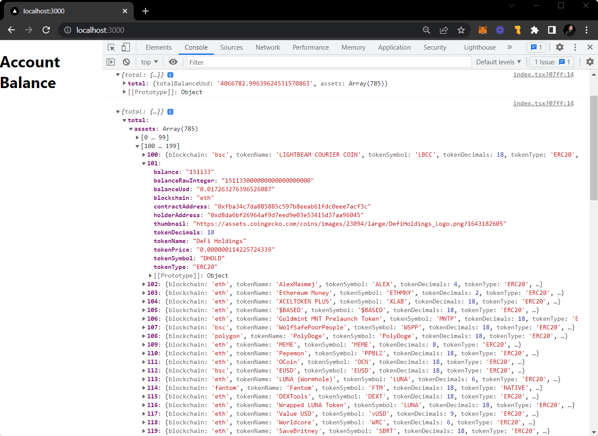

**How to check your Account Balance across Multiple Blockchains using
Ankrjs**

**Fetch Account Balance across Multiple Blockchains i.e. ETH, Polygon,
BSC, Fantom, Avalanche, Arbitrum and more.**

In this tutorial, we’ll be fetching the account balances from multiple
blockchains such as Ethereum, Polygon, and Fantom, to name a few,
using [Ankr's Advanced Multichain
APIs](https://www.ankr.com/advanced-api/)↗.

<table>
<colgroup>
<col style="width: 100%" />
</colgroup>
<tbody>
<tr class="odd">
<td>
Ankr's Advanced Multichain APIs are the collection of RPC methods
created to simplify querying blockchain data. These APIs do all the
heavy lifting for us so that we can query on-chain data in a matter of
seconds.

Currently, it supports six EVM compatible chains: Ethereum, Fantom,
Binance Smart Chain, Polygon, Avalanche, Arbitrum, with more EVM and
non-EVM chains coming soon. To interact with Ankr's Advanced APIs, we
are going to use a JavaScript library named <a
href="https://www.npmjs.com/package/@ankr.com/ankr.js">Ankr.js</a>↗
</td>
</tr>
</tbody>
</table>

## Getting Started

**Prerequisite:** To successfully finish this guide, you'll
need [Node.js](https://nodejs.org/en/)↗
and [Yarn](https://yarnpkg.com/)↗ installed on your machine.

### Step 1: Setting Up Next.js Starter Application

First up, navigate into the directory of your choice where you want to
initiate this project and run the following command in your terminal to
set up a new Next.js starter page:

npm create next-app --ts ankrjs-account-balance

You'll be able to see a couple of files and folders being created for
you. Let's dive into the newly created directory and start the
development server on localhost:3000.

npm run dev

Visit localhost:3000 to view the starter application and it will
resemble the screen attached below:

### Step 2: Installing and Setting Up Ankr.js

In this section, we will install and set up Ankr.js for querying account
balances across multichains.

We will start by installing the ankr.js package from npm:

npm install @ankr.com/ankr.js

Powershell is the reason for this issue. We need to do this on command
prompt <https://github.com/uber-web/math.gl/issues/185>

Now that we have installed the Ankr.js library, let's set up Ankr.js
by **creating a new file** named apis.ts at the root of your project
directory. We will initialize Ankr.js in this file.

To interact with Ankr's Advanced APIs, we have created a provider
instance that will serve as an interface to the APIs required to fetch
data. *Note: to use Advanced API for free starting from 29.05.2023 you
have to register on the platform.*

Get your individual endpoint
here [**https://www.ankr.com/rpc/advanced-api**](https://www.ankr.com/rpc/advanced-api) and
provide it to the AnkrProvider constructor.

<table>
<colgroup>
<col style="width: 100%" />
</colgroup>
<thead>
<tr class="header">
<th>
My ankr account

<strong>Free</strong>Your plan

You have 50 free requests/min

Used google auth to login <a
href="mailto:amitamit2@gmail.com">amitamit2@gmail.com</a>

Here is my advanced api entry point

<a
href="https://rpc.ankr.com/multichain/4035658e3524cbfe76215a86b745adc08ceae558d1fadc11aa501f5af4179178">https://rpc.ankr.com/multichain/4035658e3524cbfe76215a86b745adc08ceae558d1fadc11aa501f5af4179178</a>

<em>// npm install @ankr.com/ankr.js</em>

<em>import</em> { AnkrProvider } <em>from</em>
'@ankr.com/ankr.js';

<em>// Setup provider AnkrProvider</em>

<em>const</em> provider = <em>new</em>
AnkrProvider('https://rpc.ankr.com/multichain/4035658e3524cbfe76215a86b745adc08ceae558d1fadc11aa501f5af4179178');

<em>// Get token balances of address with USD prices among multiple
chains</em>

<em>const</em> balances = <em>async</em> () =&gt; {

<em>return</em> <em>await</em> provider.getAccountBalance({

blockchain: ['bsc', 'eth', 'polygon', 'avalanche'],

walletAddress: '0xfa9019df60d3c710d7d583b2d69e18d412257617',

});

}

Using shell command

curl --location --request POST
'https://rpc.ankr.com/multichain/4035658e3524cbfe76215a86b745adc08ceae558d1fadc11aa501f5af4179178'
\

--header 'Content-Type: application/json' \

--data-raw '{

"id": 1,

"jsonrpc": "2.0",

"method": "ankr_getAccountBalance",

"params": {

"blockchain": [

"bsc",

"eth",

"polygon",

"avalanche"

],

"walletAddress": "0xfa9019df60d3c710d7d583b2d69e18d412257617"

}

}'

Here is my api for normal api calls. We have one for each
blockchain

<a
href="https://rpc.ankr.com/eth/4035658e3524cbfe76215a86b745adc08ceae558d1fadc11aa501f5af4179178">https://rpc.ankr.com/eth/4035658e3524cbfe76215a86b745adc08ceae558d1fadc11aa501f5af4179178</a>

eth testnet

<a
href="https://rpc.ankr.com/eth_goerli/4035658e3524cbfe76215a86b745adc08ceae558d1fadc11aa501f5af4179178">https://rpc.ankr.com/eth_goerli/4035658e3524cbfe76215a86b745adc08ceae558d1fadc11aa501f5af4179178</a>

eth sepolia

<a
href="https://rpc.ankr.com/eth_sepolia/4035658e3524cbfe76215a86b745adc08ceae558d1fadc11aa501f5af4179178">https://rpc.ankr.com/eth_sepolia/4035658e3524cbfe76215a86b745adc08ceae558d1fadc11aa501f5af4179178</a>

Sample codes

<table>
<colgroup>
<col style="width: 100%" />
</colgroup>
<thead>
<tr class="header">
<th>curl -X POST
https://rpc.ankr.com/eth_sepolia/4035658e3524cbfe76215a86b745adc08ceae558d1fadc11aa501f5af4179178
-d
'{"jsonrpc":"2.0","method":"eth_blockNumber","params":[],"id":1}'</th>
</tr>
</thead>
<tbody>
<tr class="odd">
<td>
Web3.js

<em>const</em> Web3 = require('web3');

<em>const</em> url =
'https://rpc.ankr.com/eth_sepolia/4035658e3524cbfe76215a86b745adc08ceae558d1fadc11aa501f5af4179178'
<em>// url string</em>

<em>const</em> web3 = <em>new</em> Web3(<em>new</em>
Web3.providers.HttpProvider(url));

web3.eth.getBlockNumber((error, blockNumber) =&gt; {

<em>if</em>(!error) {

console.log(blockNumber);

} <em>else</em> {

console.log(error);

}

});
</td>
</tr>
<tr class="even">
<td>
Python

<em>from</em> web3 <em>import</em> Web3

<em>def</em> test_block_number(self):

url =
'https://rpc.ankr.com/eth_sepolia/4035658e3524cbfe76215a86b745adc08ceae558d1fadc11aa501f5af4179178'
<em># url string</em>

web3 = Web3(HTTPProvider(url))

<em>print</em>(web3.eth.block_number)
</td>
</tr>
<tr class="odd">
<td></td>
</tr>
<tr class="even">
<td></td>
</tr>
</tbody>
</table></th>
</tr>
</thead>
<tbody>
</tbody>
</table>

**File:** ./apis.ts

import { AnkrProvider } from '@ankr.com/ankr.js';

import type { Blockchain } from '@ankr.com/ankr.js/dist/types';

const provider = new
AnkrProvider('https://rpc.ankr.com/multichain/4035658e3524cbfe76215a86b745adc08ceae558d1fadc11aa501f5af4179178');

### Step 3: Create Function to Fetch Total Balance

In this step, we will first create a getAccountBalance function in
the ./apis.ts file, which will accept a walletAddress, and return the
coin and the respective token balance. Here we are going to utilize
the [getAccountBalance](https://documenter.getpostman.com/view/19024547/UVsEVUGQ#74b5cc68-fba2-415c-a53b-28c08818f970)↗
method provided by Ankr.js.

//getAccountBalance function to fetch coins and their respective token
balances

export const getAccountBalance = async (walletAddress: string) =\> {

    return provider.getAccountBalance({

        walletAddress,

    });

};

Let's call this function on our page i.e. ./page.tsx to check the
account balances. To do so, clear the code from the **index.tsx** file
and replace it with the one given below:

"use client"; // This is a client component

import { useEffect, useState } from 'react';

import {

  getAccountBalance} from '../apis';

export default function Home() {

  const \[total, setTotal\] = useState("fetching...");

  useEffect(() =\> {

    (async () =\> {

      const tempTotal = await getAccountBalance(

        "0xd8da6bf26964af9d7eed9e03e53415d37aa96045",

      );

      setTotal(tempTotal.totalBalanceUsd);

console.log({ tempTotal });

    })();

  }, \[\]);

  return (

    \

      \<h1 className='text-3xl font-bold'\>Account Balance (USD)\</h1\>

      \<p\>{total}\</p\>

    \</div\>

  );

}

Check console. You should be able to see the list of chains with their
respective tokens and account balances.

### \[Optional\]: Calculating the Net Worth

To calculate the sum of balances (net worth) across the chains we will
create a new function in the apis.ts file and let's call
it **getTotalMultichainBalance**.

File: ./apis.ts

//getAccountBalance function to fetch coins and their respective token
balances

export const getAccountBalance2 = async (walletAddress: string,

    blockchain: Blockchain) =\> {

    return provider.getAccountBalance({

        walletAddress,

        blockchain,

    });

};

//use getAccountBalance to sum total balance across chains

export const getTotalMultichainBalance = async (walletAddress: string)
=\> {

    let total = 0;

    let breakup = "";

    for await (const chain of listOfChains) {

        const { totalBalanceUsd, assets } = await getAccountBalance2(

            walletAddress,

            chain

        );

        total += +totalBalanceUsd;

        breakup += "\[" + chain + ":" + totalBalanceUsd + "\]";

    }

    return { total, breakup };

};

Let's call this function on our page to check the total account balance.

Add sections in the page.tsx

"use client"; // This is a client component

import { useEffect, useState } from 'react';

import {

  getAccountBalance, getTotalMultichainBalance

} from '../apis';

export default function Home() {

  const \[total, setTotal\] = useState("fetching...");

  const \[netWorth, setNetWorth\] = useState("fetching...");

  const \[breakup, setBreakup\] = useState("fetching...");

  useEffect(() =\> {

    (async () =\> {

      let tempNW = await getTotalMultichainBalance(

        "0xd8da6bf26964af9d7eed9e03e53415d37aa96045"

      );

      setNetWorth(tempNW.total.toString());

      setBreakup(tempNW.breakup);

      const tempTotal = await getAccountBalance(

        "0xd8da6bf26964af9d7eed9e03e53415d37aa96045",

      );

      setTotal(tempTotal.totalBalanceUsd);

      console.log({ tempTotal });

    })();

  }, \[\]);

  return (

    \

      \<h1 className='text-3xl font-bold'\>Account Balance (USD)\</h1\>

      \<p\>{total}\</p\>

      \<h1 className='text-3xl font-bold'\>Net Worth (USD)\</h1\>

      \<p\>{netWorth}\</p\>

      \<h1 className='text-3xl font-bold'\>breakup\</h1\>

      \<p\>{breakup}\</p\>

    \</div\>

  );

}

Now I did some more changes

In UI

- I now added a textbox to enter the account

- A button that will trigger a re-fetch of balances

"use client"; // This is a client component

import { useEffect, useState } from 'react';

import {

  getAccountBalance, getTotalMultichainBalance

} from '../apis';

export default function Home() {

  const \[account, setAccount\] =
useState("0xd8da6bf26964af9d7eed9e03e53415d37aa96045");

  const \[enteredAccount, setEnteredAccount\] =
useState("0xd8da6bf26964af9d7eed9e03e53415d37aa96045");

  const \[total, setTotal\] = useState("fetching...");

  const \[netWorth, setNetWorth\] = useState("fetching...");

  const \[breakup, setBreakup\] = useState("fetching...");

  function onAccountChange(event) {

    console.log("In onAccountChange:", event.target.value)

    setEnteredAccount(event.target.value)

  }

  function onAccountFetch(event) {

    console.log("In onAccountFetch:vlaue of enteredAccount is ",
enteredAccount)

    setTotal("fetching ....")

    setNetWorth("fetching ....")

    setBreakup("fetching ....")

    setAccount(enteredAccount);

  }

  useEffect(() =\> {

    (async () =\> {

      console.log("now in useEffect for account:", account)

      let tempNW = await getTotalMultichainBalance(account);

      setNetWorth(tempNW.total.toString());

      setBreakup(tempNW.breakup);

      const tempTotal = await getAccountBalance(account,

      );

      setTotal(tempTotal.totalBalanceUsd);

      console.log("Got the new data")

      console.log({ tempTotal });

    })();

    return () =\> {

    };

  }, \[account\]);

  return (

    \

      \<label htmlFor="account" className="block mb-2 text-sm
font-medium text-gray-900 dark:text-white"\>Account\</label\>

      {/\* \<input type="text" id="account" className="bg-gray-50 border
border-gray-300 text-gray-900 text-sm rounded-lg focus:ring-blue-500
focus:border-blue-500 block w-full p-2.5 dark:bg-gray-700
dark:border-gray-600 dark:placeholder-gray-400 dark:text-white
dark:focus:ring-blue-500 dark:focus:border-blue-500"
placeholder={account} required /\> \*/}

      \<input type="text" id="account" className="bg-gray-50 border
border-gray-300 block w-full " value={enteredAccount}
onChange={onAccountChange} required /\>

      \<button type="button" onClick={onAccountFetch}
className="text-white bg-blue-700 hover:bg-blue-800 focus:outline-none
focus:ring-4 focus:ring-blue-300 font-medium rounded-full text-sm px-5
py-2.5 text-center mr-2 mb-2 dark:bg-blue-600 dark:hover:bg-blue-700
dark:focus:ring-blue-800"\>Get Details for account\</button\>

      \<h1 className='text-3xl font-bold'\>Account Balance (USD)\</h1\>

      \<p\>{total}\</p\>

      \<h1 className='text-3xl font-bold'\>Net Worth (USD)\</h1\>

      \<p\>{netWorth}\</p\>

      \<h1 className='text-3xl font-bold'\>breakup\</h1\>

      \<p\>{breakup}\</p\>

    \</div\>

  );

}

Here is how it looks finally

